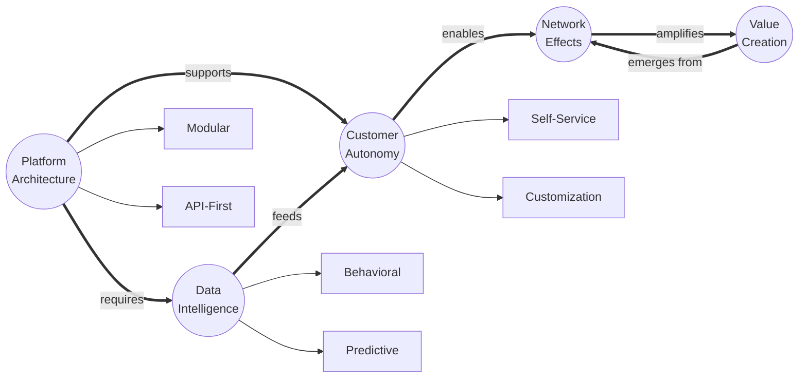

# Conceptual Skeleton Visualization Methods

## 1. **Pure Concept Network**

The raw idea structure with relationship types:



## 2. **Hierarchical Concept Tree**

Shows the logical structure of ideas:

```
🌳 ROOT: Digital Transformation Paradigm
│
├─ 🧠 TRUNK: Decentralized Intelligence
│   ├─ Branch: Autonomous Systems
│   │   ├─ Leaf: Self-Learning Algorithms
│   │   ├─ Leaf: Adaptive Interfaces
│   │   └─ Leaf: Predictive Automation
│   │
│   └─ Branch: Distributed Decision-Making
│       ├─ Leaf: Edge Computing
│       ├─ Leaf: Local Optimization
│       └─ Leaf: Federated Learning
│
├─ 💰 TRUNK: Value Redistribution
│   ├─ Branch: Creator Economy
│   │   ├─ Leaf: Direct Monetization
│   │   └─ Leaf: Micro-Ownership
│   │
│   └─ Branch: Network Value Capture
│       ├─ Leaf: Community Assets
│       └─ Leaf: Collective Intelligence
│
└─ 🔄 TRUNK: Systemic Evolution
    ├─ Branch: Continuous Adaptation
    └─ Branch: Emergent Behaviors
```

## 3. **Concept DNA Map**

The fundamental building blocks and how they combine:

```
ATOMIC CONCEPTS (Building Blocks)
────────────────────────────────
○ Autonomy        ○ Connection
○ Intelligence    ○ Distribution  
○ Adaptation      ○ Emergence

MOLECULAR CONCEPTS (Combinations)
────────────────────────────────
◐ Autonomy + Intelligence = Self-Directed Systems
◐ Connection + Distribution = Network Architecture  
◐ Adaptation + Emergence = Evolutionary Design

ORGANISM CONCEPTS (Full Systems)
────────────────────────────────
◉ Self-Directed + Network + Evolutionary 
  = Autonomous Ecosystem Platform
```

## 4. **Conceptual Force Field**

Shows the dynamic tensions and attractions between ideas:

```
        [Centralization]
              ↑↓
              ⚡
    ┌─────────┴─────────┐
    ↓                   ↓
[Control]          [Innovation]
    ↑                   ↑
    │    ←─ ⚡ ─→       │
    │                   │
[Efficiency]      [Flexibility]
    ↑                   ↑
    └─────────┬─────────┘
              ⚡
              ↑↓
       [Decentralization]

⚡ = Tension Point / Creative Synthesis Opportunity
→ = Natural Pull / Affinity
```

## 5. **Layered Abstraction Model**

From concrete to abstract:

```
Level 5: PHILOSOPHY
└─ "Empowerment through Technology"

Level 4: PRINCIPLES  
├─ User Sovereignty
├─ Open Architecture
└─ Collective Intelligence

Level 3: PATTERNS
├─ Self-Service Workflows
├─ Modular Integration
├─ Community Governance
└─ Data Feedback Loops

Level 2: MECHANISMS
├─ API Gateway
├─ ML Pipeline
├─ Token System
├─ Analytics Engine
└─ Plugin Framework

Level 1: IMPLEMENTATIONS
├─ React Dashboard
├─ Python Backend
├─ PostgreSQL
└─ Kubernetes
```

## 6. **Concept Algebra**

Mathematical-style representation of idea relationships:

```
DEFINITIONS:
A = Automation
H = Human Judgment  
S = Scale
Q = Quality
C = Cost
V = Value

RELATIONSHIPS:
Traditional: V = H × Q / C
Problem: H is bottleneck for S

New Paradigm: V = (H + A) × Q × S / C
Where: A amplifies H rather than replacing

BREAKTHROUGH:
If A → ∞ while maintaining H oversight
Then V → ∞ while C → stable
Therefore: Exponential value creation
```

## 7. **Semantic Constellation**

Concept clusters with gravitational relationships:

```
    ✦ Innovation Core ✦
         ╱    │    ╲
        ╱     │     ╲
    Speed  Quality  Scale
      ╲      │      ╱
       ╲     │     ╱
        ⟨ Balance ⟩
            │
    ┌───────┴───────┐
    │               │
Process          Product
Cluster          Cluster
    │               │
• Agile         • Features
• DevOps        • UX/UI
• CI/CD         • Performance
• Testing       • Security
```

## 8. **Conceptual Circuit Diagram**

Shows how ideas flow and transform:

```
[Input: Market Need] ──→ ⊕ ←── [Data Intelligence]
                         │
                    [Processing]
                         │
            ┌────────────┼────────────┐
            ↓            ↓            ↓
      [Automate]   [Augment]   [Analyze]
            ↓            ↓            ↓
            └────────────┼────────────┘
                         │
                 [Value Creation]
                         │
                    ⊕ ←──┘ (Feedback)
                    │
            [Output: Solution]
```

## The Meta-Structure

What you're really looking for is the **conceptual skeleton** that shows:

1. **Atomic Ideas** - The indivisible units
2. **Binding Forces** - How they connect
3. **Emergent Structures** - What they become together
4. **Dynamic Tensions** - Where energy/innovation lives
5. **Transformation Paths** - How ideas evolve

This is the difference between reading about anatomy and seeing an X-ray - you want to see the bones, not hear about them.